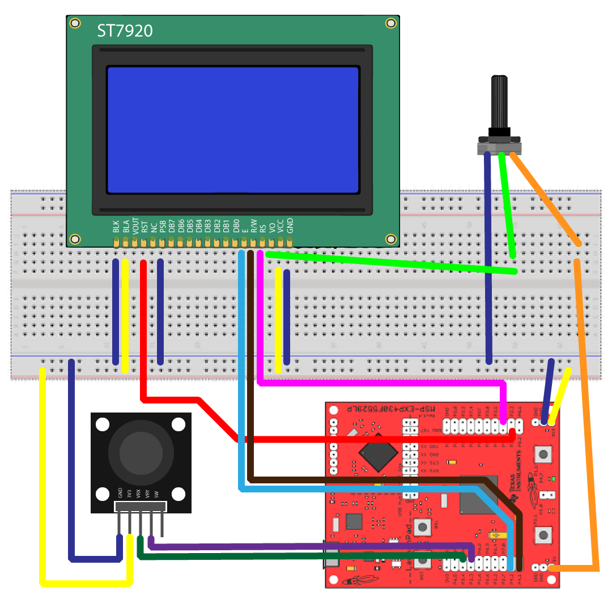

# Snake Game

## Resumo

Snake é um jogo conhecido internacionalmente, possuindo diversas variações de implementação e presente em diversas plataformas. O projeto atual teve como objetivo implementar uma versão desse tão aclamado jogo no microcontrolador MSP430F5529, da Texas Instruments.

## Componentes

A implementação do jogo Snake neste projeto foi feita utilizando a linguagem de programação C e, ainda, para o desenvolvimento foram utilizados os seguintes componentes:

- MSP430F5529
- LCD Display Gráfico ST7920
- Módulo Sensor Comando por Alavanca (Joystick)
- Potenciômetro 10kΩ
- Protoboard
- Jumpers

